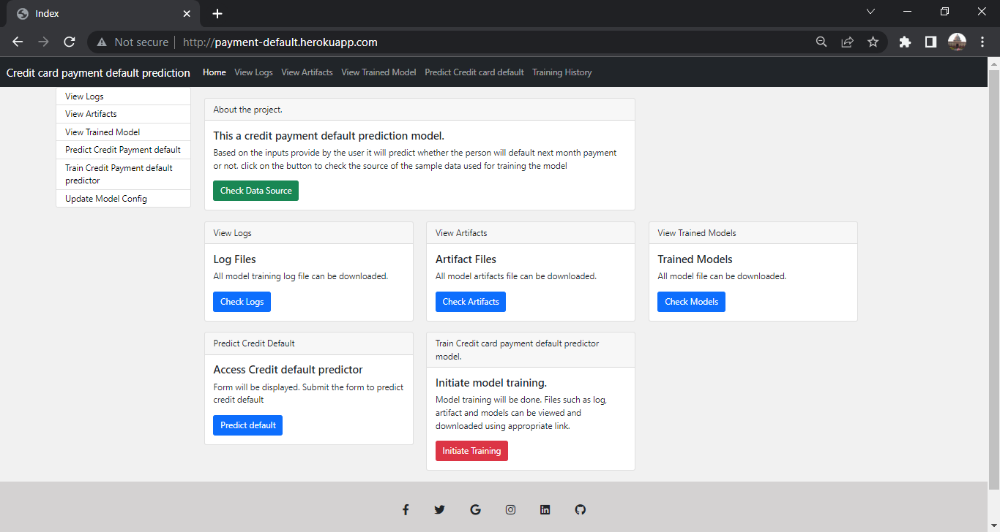
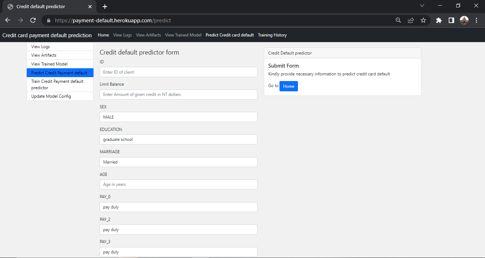
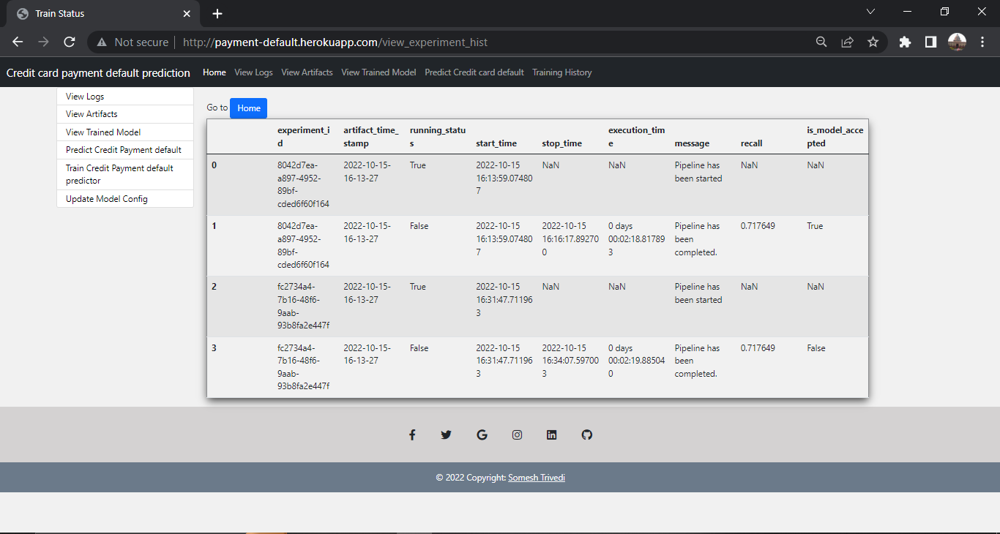

# ML_Payment_default_predictions version 2
Machine learning project to predict credit card default

This a credit payment default prediction project.
Based on the inputs provide by the user it will predict whether the person will default next month payment or not.

Web Application [Payment default predictor](http://payment-default.herokuapp.com/)

To use check the application click on the link above

Click on Predict Credit Payment default

Check Training history

